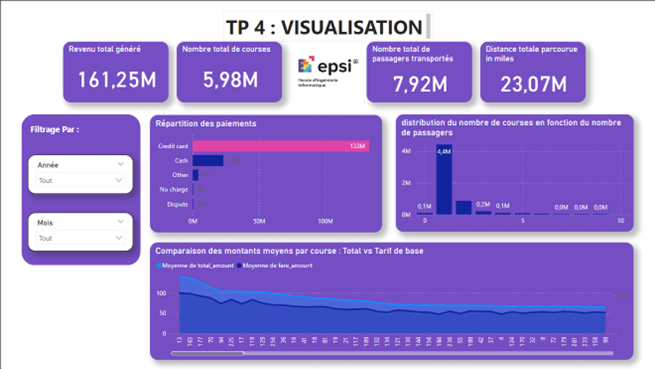

# ATL-Datamart Project

## Projet pour le Cours d'atelier Architecture décisionnelle Datamar

## Prérequis

Avant de démarrer le projet, assurez-vous d'avoir installé les outils suivants :

- **Git**
- **Docker Desktop**
- **Python 3.x**

## Lancer l'infrastructure avec Docker Compose
Une fois que le projet est cloné, vous pouvez utiliser Docker Compose pour lancer l'infrastructure.

Pour démarrer les services (MinIO, PostgreSQL, etc.), exécutez la commande suivante :

**docker compose up**

Pour stopper l'infrastructure, exécutez :

**docker compose down**

## Accéder à MinIO
Accédez à MinIO via l'interface web à l'adresse http://localhost:9000.
Utilisez les identifiants par défaut :
Identifiant : minio
Mot de passe : minio123

## TP1 : Téléchargement et Chargement de Données sur MinIO
L'objectif de ce TP est de télécharger des fichiers de données au format .parquet depuis une source externe, de les organiser localement, puis de les charger dans MinIO, un service de stockage d'objets.

Le script Python grab_parquet.py est utilisé pour télécharger les fichiers et les charger sur MinIO.

## TP2 : Transfert des données depuis le Data Lake (MinIO) vers le Data Warehouse (PostgreSQL)
Ce TP se concentre sur le transfert des données depuis MinIO (Data Lake) vers PostgreSQL (Data Warehouse). Les fichiers .parquet sont lus et insérés dans une table PostgreSQL via le module pandas.

## TP3 : Conception d'un Data Mart avec PostgreSQL - Implémentation d'un Modèle Flocon
Dans ce TP, nous avons conçu un Data Mart en créant un modèle Flocon avec plusieurs tables de dimensions et une table factuelle. Les données sont extraites du Data Warehouse et insérées dans les tables du Data Mart.

## TP4 : Visualisation
Les données du Data Mart sont importées dans PowerBI pour créer des visualisations interactives, notamment des graphiques sur les revenus, les courses et le nombre de passagers.
voici le lien pour telecharger le Dashboard du TP4 : https://drive.google.com/file/d/1eu1yH_ZxzGdmS094ZCG6SHPx6udEhsTe/view?usp=sharing

## TP5 : Automatisation du TP1 avec Airflow
Ce TP automatise le processus du TP1 à l'aide d'Airflow. Le téléchargement des données et leur chargement dans MinIO sont programmés pour être exécutés automatiquement via un DAG (Directed Acyclic Graph) dans Airflow.

Conclusion
Ce projet fournit une démonstration complète de l'architecture décisionnelle, allant de l'extraction des données à leur visualisation, en passant par la création d'un Data Mart et l'automatisation des processus. Grâce à Docker, MinIO, PostgreSQL, et Airflow, nous avons créé une solution robuste et flexible pour gérer de grandes quantités de données et les transformer en informations utiles.
